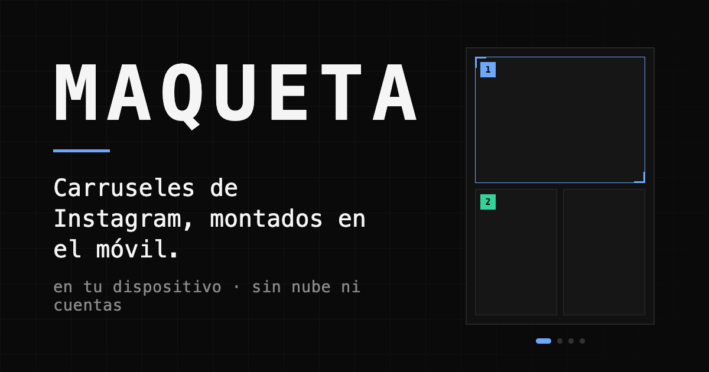

# Maqueta

**Carruseles de Instagram, montados en el móvil.** En tu dispositivo, sin nube ni
cuentas: las fotos nunca salen del navegador.

▶︎ **<https://urieljavier.github.io/carrete/>**

Nació como **Carrete**, un solo fichero HTML iterado sobre el móvil. Esa versión
sigue en `reference/carrete-3.13.2.html` y se abre con doble clic, sin servidor.
Este repo es el paso siguiente, ya como Maqueta: mismo espíritu, arquitectura
modular y con tests.

## Qué hace

- **Carruseles y stories.** Proporciones de feed (1:1, 4:5, 3:4…) y **9:16** para
  stories, con vistas previas de feed, perfil y reproductor.
- **Rejillas.** 28 layouts, incluidos algunos que **encajan entre páginas**.
- **Grupos (máscaras).** Varias celdas comparten una misma foto como una máscara,
  dentro de una página o **cruzando páginas**; encuadras la foto compartida y
  gestionas los grupos como herramientas.
- **Texto.** Fuente, color, tamaño, rotación, interlineado, negrita/cursiva y
  guías magnéticas hacia los centros y el margen de seguridad.
- **Relleno de huecos** con color o con la propia foto desenfocada.
- **Vídeo.** Export a MP4 de carruseles mixtos (foto + vídeo), respetando FPS y
  orientación de origen.
- **Biblioteca y proyectos.** Todo persiste en el dispositivo (IndexedDB): peso
  por proyecto, barra de espacio, y borrado de fotos sin usar.
- **Export** a PNG/JPG al ancho nativo de Instagram (1080 px) y ZIP de una descarga.

## Empezar

```bash
npm install
npm run dev      # servidor de desarrollo
npm test         # 171 tests sobre la lógica pura y flujos de integración
npm run build    # bundle en dist/
```

## Las dos ideas que sostienen el resto

**1. Espacio del post.** El post es un lienzo continuo. Las celdas no pertenecen a
una página: viven en espacio de post, donde `x` se mide en unidades de página
(0..N) e `y` en 0..1. Una página no es un contenedor, es una **ventana de recorte**:
la página *i* es la región `[i, i+1]`. Una celda con `{x: 0.5, w: 1}` ocupa media
página 1 y media página 2, y `drawRegion` la dibuja bien. Por eso los layouts —y
los grupos— a caballo entre páginas no tocan el renderizador ni el export.

**2. Todo relativo.** Ni el preview ni el clamp usan píxeles medidos. La foto se
coloca en múltiplos del tamaño de su celda y su encuadre se guarda normalizado como
`{scale, fx, fy}`, donde `scale: 1` es el *contain* exacto. Lo que ajustas sobre un
preview se aplica idéntico al exportar desde el original — hay un test que verifica
ese invariante sobre cientos de combinaciones, con desviación 0.

## Estructura

Cuatro capas, cada una conoce solo a la de debajo:

```
src/core/     lógica pura, sin DOM ni React. Es lo que está más testeado.
              layouts · geometry (encuadre, espacio de post, drawRegion) ·
              color (ICC→sRGB) · image · post · format · db (IndexedDB)
src/state/    reducer del post + historial de deshacer/rehacer
src/hooks/    lo que necesita navegador, aislado del aspecto
src/styles/   sistema de diseño: tokens.css es LA fuente de valores
src/ui/       primitivas sin dominio (Button, ToolBox, Toast, Dialog…)
src/features/ cada vista con su CSS Module (editor, feed, perfil, biblioteca,
              proyectos, export)
tests/        171 tests: core + state (unidad) y tests/flows/ (integración)
```

## Notas de diseño que parecen raras y no lo son

- **`drawRegion` es la única fuente de render**: feed, perfil, miniaturas y export
  salen de la misma función. Un cambio de geometría se ve igual en todas partes.
- **El gap es la separación visible, no un margen por celda.** En cada costura se
  reparte a medias; en el borde de la página va entero (si no, una página suelta no
  quedaba centrada).
- **Giro y espejo se aplican a los píxeles**, no a la geometría; el punto focal se
  transporta con `turnFocal`.
- **El historial retiene las fotos.** `docImageIds` cuenta las fotos de celdas *y*
  de grupos, en el post y en el historial: sin eso, la foto de un grupo se barría
  como huérfana al refrescar.
- **La huella de una foto es un SHA-256 de su contenido**, para avisar de repetidas
  aunque se importe dos veces por separado.
- **ProPhoto→sRGB lleva adaptación de Bradford** (D50→D65); sin adaptar, el blanco
  salía verdoso. Lo encontró un test.

## Paleta

Deliberadamente neutra: la app muestra fotos y cualquier color alrededor falsea cómo
se perciben. El color solo significa estado, y cada tono uno: azul = selección,
verde = destino de arrastre, ámbar = aviso, naranja = foto repetida, rojo =
destructivo. Todos los valores viven en `src/styles/tokens.css` (cero hex fuera de
ahí, verificado).

## Export y peso

Las páginas se exportan a **1080 px** de ancho (lo que sirve el feed de Instagram) y
se empaquetan en un **ZIP** con las imágenes sin recomprimir. **PNG por defecto**:
montar un carrusel no debería añadir otra generación de recompresión encima de la del
fichero original. El fondo puede ser **transparente** (fuerza PNG) como paso
intermedio para componer sobre vídeo en otra herramienta — Instagram aplana el alfa.
